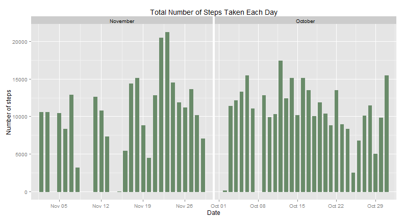
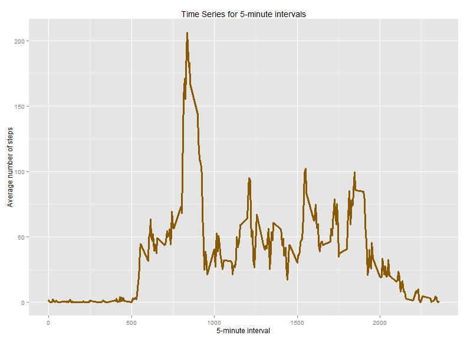

# Reproducible Research: Peer Assessment

### Author:  Sue Stacey


```r
library(knitr)
library(lubridate)
library(ggplot2)
library(lattice)
suppressMessages(library (dplyr))

options(scipen = 1)
```

## Loading and preprocessing the data
If the file has not been extracted to the ./activity directory, extract the file

```r
     targetZipFile <- "activity.zip"
     targetResultFile <- "activity.csv"
     dataPath <- "./activity"
     extractedZipPath <- "./activity"
     
     targetResultFilePath <- file.path(dataPath,targetResultFile)
     
     if (!file.exists(extractedZipPath)) {
          unzip(targetZipFile, exdir = dataPath, overwrite = TRUE)
     } else if (!file.exists(targetResultFilePath)) {
          unzip(targetZipFile, exdir = dataPath, overwrite = TRUE)
     } else {
          print("zip file extracted")
     }
```

```
## [1] "zip file extracted"
```

```r
     activity <- read.csv(targetResultFilePath)
     activity$month <-as.numeric(format(as.Date(activity$date), "%m"))
```

## What is mean total number of steps taken per day?
1.  Calculate the total number of steps taken per day.

```r
     stepsByDay <- tapply(activity$steps, activity$date, sum)
```
2. Make a histogram of the total number of steps taken each day.

```r
     ggplot(activity, aes(as.Date(date),steps)) +
          geom_bar(stat = "identity", color = "darkseagreen4", fill = "darkseagreen4", width =.6) + 
          facet_grid(. ~ month, scales = "free") +
          labs(title = "Total Number of Steps Taken Each Day", x = "Date", y = "Number of steps")
```

```
## Warning: Removed 576 rows containing missing values (position_stack).
```

```
## Warning: Removed 1728 rows containing missing values (position_stack).
```

 

3. Calculate and report the mean and median of the total number of steps taken per day.

```r
     stepsByDayMean <- mean(stepsByDay, na.rm=TRUE)
     stepsByDayMedian <- median(stepsByDay, na.rm=TRUE)
```
The mean of the total number of steps taken per day is 10766.1886792.

The median of the total number of steps taken per day is 10765.

## What is the average daily activity pattern?
1. Compute the average steps for each time block.

```r
     avgPerInterval <- aggregate(x=list(steps=activity$steps), by=list(interval=activity$interval), FUN=mean, na.rm=TRUE)
     names(avgPerInterval)[2]<-"avgStepsPerInterval"
```

2.  Plot the time series block.

```r
     library(ggplot2)
     ggplot(avgPerInterval, aes(interval,avgStepsPerInterval)) +
          geom_line(color = "orange4", size = 1.1) +
          labs(title = "Time Series for 5-minute intervals", x = "5-minute interval", y =
     "Average number of steps")    
```

 

3. On average, 

```r
     maxNumSteps <-format(avgPerInterval[which.max(avgPerInterval$avgStepsPerInterval),2],digits=1)
     maxNumStepsInterval <-avgPerInterval[which.max(avgPerInterval$avgStepsPerInterval),1]
     maxNumStepsItime <-gsub("([0-9]{1,2})([0-9]{2})", "\\1:\\2",maxNumStepsInterval)
```

The 5-minute interval at 8:35 contains the maximum number of steps, 206, on average across all the days in the dataset.

## Imputing missing values

1.  Missing values are imputed using the mean of the 5-minute interval. Calculate for and replace the missing values.

```r
     imputedData <- activity 
     for (i in 1:nrow(imputedData)) {
          if (is.na(imputedData$steps[i])) {
               imputedData$steps[i] <- avgPerInterval[which(imputedData$interval[i] == avgPerInterval$interval), ]$avgStepsPerInterval
          }
     }
```
2.  Plot the time series with the imputed data.

```r
     ggplot(imputedData, aes(as.Date(date), steps)) + 
          geom_bar(stat = "identity", color = "gold2", fill = "gold2", width =.6) + 
          facet_grid(. ~ month, scales = "free") + 
          labs(title = "Total Number of Steps Taken Each Day (with imputed data)", x = "Date", y = "Number of steps")
```

-1.png) 
3.  Describe the results of imputing the missing data.

```r
     noNA<-na.omit(activity)
     numRowsTotal<-nrow(activity)
     numRowsNA<-numRowsTotal-nrow(noNA)
     newTotalSteps <- tapply(imputedData$steps, imputedData$date, sum)
     imputedStepsByDayMean <- mean(newTotalSteps)
     imputedStepsByDayMedian <- median(newTotalSteps)
```
 The total number of rows in the raw dataset: 17568 
 
 The total number of rows with NA data: 2304
 
 Mean of Steps Per Day with NA data: 10766.1886792
 
 Median of Steps Per Day with NA data: 10765
 
 Mean of Steps Per Day with imputed data: 10766.1886792
 
 Median of Steps Per Day with imputed data: 10766.1886792


## Are there differences in activity patterns between weekdays and weekends?
1.  Factor the dataset into 2 buckets: weekend data and weekday data.

```r
     imputedData$DOW <- format(as.Date(imputedData$date), "%A")
     imputedData$DOW<-factor(imputedData$DOW, levels=unique(imputedData$DOW))
     
     weekday = c("Monday", "Tuesday","Wednesday","Thursday", "Friday")
     weekend = c("Saturday", "Sunday")
     for (i in 1:nrow(imputedData)) {
          if (imputedData$DOW[i] %in% weekday) {
               imputedData$weekdayOrEnd[i] <- "Weekday"
               }
          if (imputedData$DOW[i] %in% weekend) {
               imputedData$weekdayOrEnd[i] <- "Weekend"
               }
          }
     imputedData$weekdayOrEnd <-factor(imputedData$weekdayOrEnd, levels=unique(imputedData$weekdayOrEnd))
     
     weekendCount <- imputedData %>% filter((DOW=="Saturday") | (DOW=="Sunday")) %>% count()
     weekdayCount <- imputedData %>% filter((DOW=="Monday") | (DOW=="Tuesday") | (DOW=="Wednesday") | (DOW=="Thursday") | (DOW=="Friday")) %>% count()
```
Weekend Count:  4608

Weekday Count:  12960

```r
     avgSteps <- aggregate(x=list(steps=imputedData$steps), 
                    by=list(interval=imputedData$interval, weekdayOrEnd=imputedData$weekdayOrEnd), FUN=mean)

     names(avgSteps)[3] <- "meanSteps"
```
2.  The Weekday vs Weekend plot clearly indicates a difference in the 5-minute interval period when personal movement occurs.  During the week, the highest use period appears to be quite concentrated in the early hours.  During the weekend, there's a wide variance when the personal movement occurs.

```r
     xyplot(avgSteps$meanSteps ~ avgSteps$interval | avgSteps$weekdayOrEnd, 
            layout = c(1, 2), type = "l", col="cadetblue4", lwd=2.5,
            xlab = "5-minute Interval", ylab = "Number of steps")     
```

-1.png) 
     
